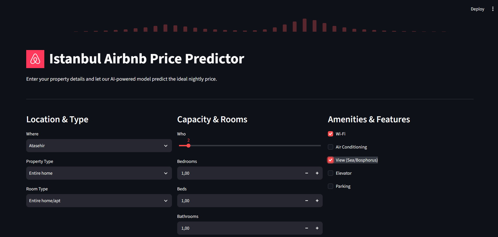

# Airbnb Istanbul Price Predictor (ML Engine)
[App](https://airbnb-pricing-ml.streamlit.app/)


## Project Overview 

ML project predicts optimal nightly prices for Istanbul Airbnbs:
**Modeling**: Evaluated four regression models, ultimately selecting and tuning LightGBM with Optuna for maximum accuracy.

**Deployment**: Built a Streamlit web app where users can input property details to get instant, data-driven price suggestions.


## Pipeline Workflow

### 1. Data Preprocessing & Feature Engineering
To ensure the model learns from high-quality data, the raw Airbnb dataset underwent a rigorous preprocessing phase:
* **Handling Missing Values:** Cleaned and imputed missing data points.
* **Categorical Encoding:** Applied **One-Hot Encoding** to categorical variables such as neighborhood names and property types so the mathematical models could process them.
* **Feature Selection:** Kept relevant features that directly impact pricing (accommodates, bedrooms, bathrooms, Wi-Fi, AC, views) and filtered out noisy data.

### 2. Model Training & Comparison
To find the best predictive engine, four different regression models were trained, evaluated, and compared against each other using standard regression metrics (like RMSE and MAE):
1. **Linear Regression** (Base model)
2. **Random Forest Regressor**
3. **XGBoost Regressor**
4. **LightGBM Regressor**

After thorough evaluation, **LightGBM** outperformed the others in both speed and accuracy, making it the champion model for this project.

### 3. Hyperparameter Optimization with Optuna
To squeeze the maximum performance out of the winning model, **Optuna** was utilized for advanced hyperparameter tuning. By running multiple trials, Optuna automatically searched the parameter space and identified the most optimal hyperparameter combination for the LightGBM model.

### 4. Deployment via Streamlit
The finalized and optimized LightGBM model was serialized (saved as a `.pkl` file) and integrated into a modern web interface. 
* Developed using **Streamlit**, the application provides a user-friendly and aesthetically pleasing UI.
* It features dynamic drop-downs, sliders, and checkboxes.

## How to Run This Project Locally

**1. Clone the repository:**
```bash
git clone [https://github.com/irmakoznrgz/airbnb-pricing-ml-engine.git](https://github.com/irmakoznrgz/airbnb-pricing-ml-engine.git)

cd airbnb-pricing-ml-engine

pip install -r requirements.txt

streamlit run app.py

